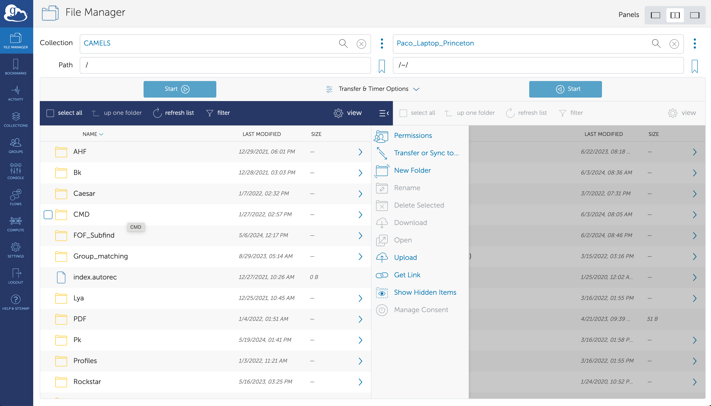

.. attention::

   All the simulations in the IllustrisTNG, SIMBA, Astrid, and N-body suites are publicly available. To access other simulations (e.g. Magneticum, Swift-EAGLE, Ramses...etc) please fill up `this form <https://forms.gle/XMVwuzhCMvnhFiaHA>`_.

.. _data_access:
   
***********
Data Access
***********

CAMELS data is stored at the Rusty cluster of the Flatiron Institute in New York City and its data can be accessed in different ways:

Binder
~~~~~~

Binder is a system that allows users to read and manipulate data that is hosted at the Flatiron Institute through either a Jupyter notebook or a unix shell. The user can find some basic documentation `here <https://docs.simonsfoundation.org/index.php/Public:Binder>`_. All CAMELS data can be accessed, read, and manipulated through Binder. 

.. warning::

   Two important things need to be taken into account when using Binder. First, the Binder environment is ephemeral - after a few days of inactivity its contents are deleted, so one has to be vigilant about downloading any analysis results in time. Second, Binder is not designed to carry out long and heavy calculations. In this case we recommend the user to download the data and work with it locally.

.. important::

   As of July 2024, we require users interested in using binder to fill up `this google form <https://forms.gle/1d185TKeJNZVCoYW6>`__. Please reach out to us at camel.simulations@gmail.com if you do not have access after 1-2 days from the time of filling up the form.

.. image:: https://mybinder.org/badge_logo.svg
   :target: https://binder.flatironinstitute.org/~sgenel/CAMELS_PUBLIC

Globus
~~~~~~~

The full CAMELS data can be downloaded via globus, an online system designed to efficiently transfer large amounts of data. This is the method we recommend to transfer the data.

`Globus link <https://app.globus.org/file-manager?origin_id=58bdcd24-6590-11ec-9b60-f9dfb1abb183&origin_path=%2F>`_

.. warning::

   Note that to download the data to your personal local machine (e.g. laptop) you will need to install the globus connect personal.

The simplest way to transfer data is to use the `globus <https://www.globus.org>`_ graphical environment. Just type CAMELS in collection or click `this link <https://app.globus.org/file-manager?origin_id=58bdcd24-6590-11ec-9b60-f9dfb1abb183&origin_path=%2F>`_. You will need to choose where the data is being moved in the other collection (e.g. your laptop or another supercomputer). Once the collection points are set, select the data you want to transfer and destiny folder and click in Start.

In some cases, there are so many files in a given directory, that globus may not be able to list them all and will return an error. If this is the case, it is advisable to use the path line. For instance, if by clicking in ``/Sims/IllustrisTNG/L25n256/SB28`` you get a time out error, you may want to just type in the path line: ``/Sims/IllustrisTNG/L25n256/SB28`` or ``/~/Sims/IllustrisTNG/L25n256/SB28/``. This may show you the different content of the data and allow you to navigate it. You can also go to a given directory directly from there. E.g. to access the first realization of the fiducial cosmology, type in path: ``/Sims/IllustrisTNG/L25n256/SB28/SB28_0/`` or ``/~/Sims/IllustrisTNG/L25n256/SB28/SB28_0/``.

In some cases, the above option may not be desirable. For instance, imagine that you want to download all Subfind catalogs of the Astrid LH simulations at redshift 0. One of such files (realization 45) is located in ``/FOF_Subfind/Astrid/L25n256/LH/LH_45/groups_090.hdf5``, while the file for the realization 89 is located in ``/FOF_Subfind/Astrid/L25n256/LH/LH_89/groups_090.hdf5``.

Thus, to download all those files without involving downloading all catalogs at all redshifts, will require that you access each simulation folder, then the ICs folder and then transfer the file individually. For 1,000 files this is unpractical. For these situations, we recommend using the globus `Command Line Interface (CLI) <https://docs.globus.org/cli/>`_. The first step is to install the CLI package, if you don't have it. Next, login into globus by typing in a terminal

.. code-block:: bash

   globus login

Then, the following command allow you to determine the associated endpoint of the CAMELS simulations:

.. code-block:: bash
		
   globus endpoint search "CAMELS"

::
   
   ID                                   | Owner                                                        | Display Name       
   ------------------------------------ | ------------------------------------------------------------ | -------------------
   58bdcd24-6590-11ec-9b60-f9dfb1abb183 | c7193490-023d-4e75-9cc5-07d06c8ab265@clients.auth.globus.org | CAMELS  

You should do the same to know the endpoint of the machine where you are transfering the data to. You can then explore the filesystem of the CAMELS simulations (or your machine) as:

.. code-block:: bash
		
   ep1=58bdcd24-6590-11ec-9b60-f9dfb1abb183
   globus ls $ep1:/Sims/IllustrisTNG/L25n256/LH/LH_0/

The above command will list the content in the ``/Sims/IllustrisTNG/L25n256/LH/LH_0/`` directory. A single file can be transfered as:

.. code-block:: bash
   
   ep1=58bdcd24-6590-11ec-9b60-f9dfb1abb183
   ep2=ddb59af0-6d04-11e5-ba46-22000b92c6ec
   globus transfer $ep1:/FOF_Subfind/Astrid/L25n256/LH/LH_89/groups_090.hdf5 $ep2:/CAMELS/Subfind/LH/LH_89/groups_090.hdf5``. --label "single file transfer"

Where ep2 should be the endpoint of the machine where you are transfering the data and ``/CAMELS/Subfind/LH/LH_89/`` is the directory in your local machine or cluster where the file ``groups_090.hdf5`` is going to be moved to. Entire folders can be moved as follows:

.. code-block:: bash
		
   ep1=58bdcd24-6590-11ec-9b60-f9dfb1abb183
   ep2=ddb59af0-6d04-11e5-ba46-22000b92c6ec
   globus transfer $ep1:/FOF_Subfind/Astrid/L25n256/LH/LH_89 $ep2:/CAMELS/Subfind/LH/LH_89  --recursive --label "single folder transfer"

Many folders can be moved with a single command as

.. code-block:: bash

   ep1=58bdcd24-6590-11ec-9b60-f9dfb1abb183
   ep2=ddb59af0-6d04-11e5-ba46-22000b92c6ec
   globus transfer $ep1:/FOF_Subfind/Astrid/L25n256/LH/ $ep2:/CAMELS/Subfind/LH/ --batch --label "CLI 10 folders" < folders.txt

where folders.txt is a text file containing

.. code-block:: bash
		
    --recursive 0 0
    --recursive 1 1
    --recursive 2 2
    --recursive 3 3
    --recursive 4 4
    --recursive 5 5
    --recursive 6 6
    --recursive 7 7
    --recursive 8 8
    --recursive 9 9

For more options and details see `Command Line Interface (CLI) <https://docs.globus.org/cli/>`_.

   
url
~~~

We provide access to the full CAMELS data via a simple uniform resource locator (url). We do not recommend downloading large amounts of data through this system, as can be slow and unstable. However, for small or individual files it may be convenient.

`URL link <https://users.flatironinstitute.org/~camels/>`_

FlatHUB
~~~~~~~

FlatHUB is a platform that allows users to explore and compare data from different simulations by browsing and filtering the data, making simple preview plots, and downloading sub-samples of the data. We provide access to the SUBFIND halo and subhalo catalogues of the IllustrisTNG and SIMBA suites through this platform.

`Link to FlatHUB <https://flathub.flatironinstitute.org/camels>`_

Rusty
~~~~~

Users with an account on the Flatiron Institute Rusty cluster, can find all CAMELS data in ``/mnt/ceph/users/camels/PUBLIC_RELEASE``.

​
