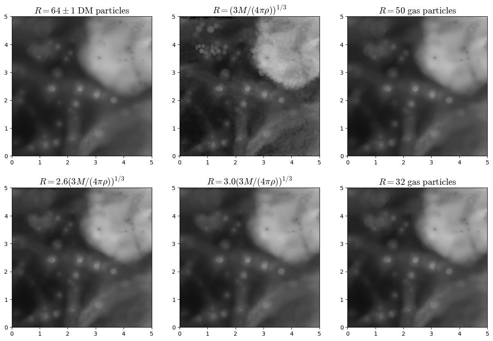

******
Images
******

There are two different ways to create images from the simulations:

Column density
--------------

The first option is to create images by computing the column density along the center of each pixel. The next script computes the column density of the gas temperature as

.. math::
   
   \bar{T}(x,y) = \frac{\int m(x,y,z)T(x,y,z) dz}{\int m(x,y,z)dz}

where :math:`m(x,y,z)` and :math:`T(x,y,z)` are the gas mass and temperature at position :math:`(x,y,z)`.
   
.. code-block::  python

   import numpy as np
   import MAS_library as MASL
   import camels_library as CL
   import h5py

   ##################################### INPUT ######################################
   # input and output files
   snapshot = '/mnt/ceph/users/camels/Sims/IllustrisTNG/LH_0/snap_033.hdf5'
   f_out    = 'gas_temperature.npy'

   # region over which make the image (should be squared)
   x_min, x_max = 0.0, 25.0 #Mpc/h
   y_min, y_max = 0.0, 25.0 #Mpc/h
   z_min, z_max = 0.0, 5.0 #Mpc/h 
   grid         = 250      #image will have grid x grid pixels
   
   # parameters to compute column density
   plane    = 'XY'  #plane to project the region: 'XY', 'YZ', 'XZ'
   periodic = True  #whether treat image as periodic in the considered plane

   # KDTree parameters
   k       = 32 #number of neighborghs
   threads = -1
   ##################################################################################
   
   # read gas position and masses
   f        = h5py.File(snapshot, 'r')
   BoxSize  = f['Header'].attrs[u'BoxSize']/1e3  #Mpc/h
   redshift = f['Header'].attrs[u'Redshift']
   pos_g    = f['PartType0/Coordinates'][:]/1e3  #Mpc/h
   pos_g    = pos_g.astype(np.float32)           #positions as float32
   Mg       = f['PartType0/Masses'][:]*1e10      #Msun/h
   f.close()
   T        = CL.temperature(snapshot)           #K
   Rg       = CL.KDTree_distance(pos_g, pos_g, k, BoxSize*(1.0+1e-8), threads, verbose=False) #Mpc/h
   Rg       = Rg.astype(np.float32)              #radii as float32

   # select the particles in the considered region
   indexes = np.where((pos_g[:,0]>x_min) & (pos_g[:,0]<x_max) &
		      (pos_g[:,1]>y_min) & (pos_g[:,1]<y_max) &
                      (pos_g[:,2]>z_min) & (pos_g[:,2]<z_max))[0]
   pos_g_ = pos_g[indexes]
   T_     = T[indexes]
   Mg_    = Mg[indexes]
   Rg_    = Rg[indexes]

   if   plane=='XY':  axis_x, axis_y, width = 0, 1, x_max-x_min
   elif plane=='YZ':  axis_x, axis_y, width = 1, 2, y_max-y_min
   elif plane=='XZ':  axis_x, axis_y, width = 0, 2, z_max-z_min

   # project gas mass*temperatures into a 2D map
   TM = np.zeros((grid,grid), dtype=np.float64)
   MASL.voronoi_RT_2D(TM, pos_g_, T_*Mg_, Rg_, x_min, y_min, 
		      axis_x, axis_y, width, periodic, verbose=True)

   # project gas mass into a 2D map
   M = np.zeros((grid,grid), dtype=np.float64)
   MASL.voronoi_RT_2D(M, pos_g_, Mg_, Rg_, x_min, y_min,
		      axis_x, axis_y, width, periodic, verbose=True)

   # compute mean temperature 
   T = TM/M
   print('%.3e < T < %.3e'%(np.min(T), np.max(T)))

   # save image to file
   np.save(f_out, T)

The image can be plotted with something like this:

.. code-block::  python

   import numpy as np
   from pylab import *
   from matplotlib.colors import LogNorm

   image = np.load('gas_temperature.npy')
   f_out = 'gas_temperature.png'

   fig = figure()
   ax1 = fig.add_subplot(111) 
   ax1.imshow(image.T, cmap=get_cmap('binary_r'), origin='lower', interpolation='bicubic',
	      extent=[0,25,0,25], norm = LogNorm(vmin=2e3,vmax=1e7))
   savefig(f_out, bbox_inches='tight')
   close(fig)

Producing this image:

.. image:: gas_temperature.png
   :align: center 

The most important thing is to define the radius of the gas particles. There are multiple possibilities for this:

- For IllustrisTNG, each gas particle can be approximated as sphere with the same volume as the one of its voronoi cell, i.e., :math:`R=(3M/(4\pi\rho))^{1/3}`.

- The above radius definition can be expanded by an overll factor to avoid empty regions.
  
- The radius can be considered as the distance to the k nearest gas particle.

The below image shows how different definitions led to different results:

We recommend using as radius of a gas particle the distance to its 32th nearest gas particle.

3D fields slices
----------------
