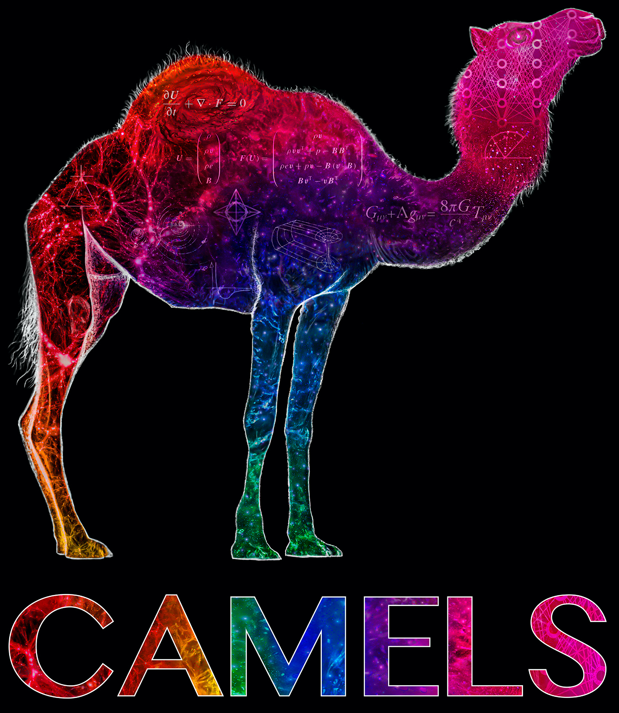

****
Logo
****

The CAMELS logo was designed taking into account its three main components:

- **Cosmology**: showing the large-scale structure of the Universe on the left.
- **Astrophysics**: represented by the galaxy and the stars in the front legs.
- **Machine Learning**: illustrated as an artificial neural network in the camel head.
  

