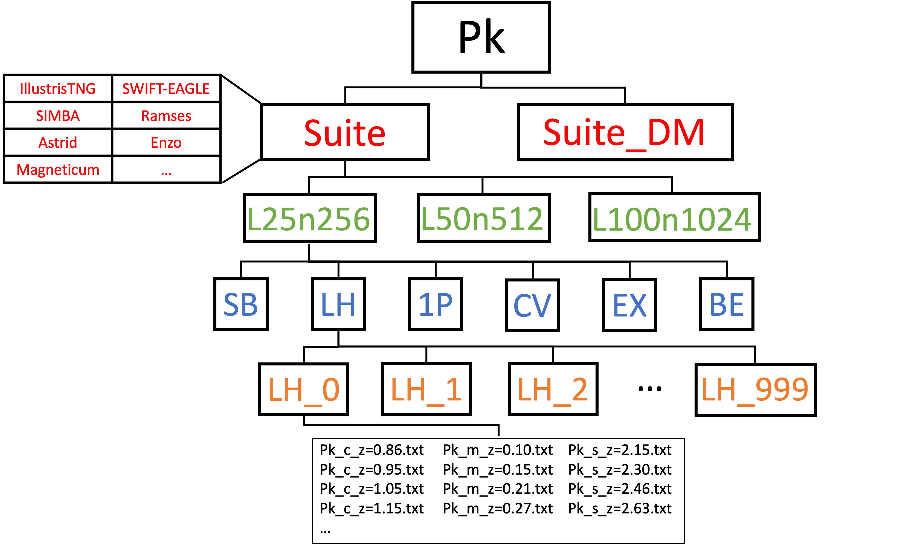

.. _organization:

*****************
Data organization
*****************

CAMELS data is organized in a hierarchical way.

Type folders
~~~~~~~~~~~~

At the highest level, CAMELS contains different `type folders`:

- ``Sims``. This folder contains the raw output from the simulations.
- ``FOF_Subfind``. This folder contains the Subfind halo and subhalo catalogues.
- ``Rockstar``. This folder contains the Rockstar halo and subhalo catalogues.
- ``Caesar``. This folder contains the CAESAR halo and subhalo catalogues.
- ``AHF``. This folder contains the AMIGA Halo Finder (AHF) halo and subhalo catalogues.
- ``Pk``. This folder contains the power spectra measurements.
- ``Bk``. This folder contains the bispectra measurements.
- ``PDF``. This folder contains the PDF measurements.
- ``VIDE_Voids``. This folder contains the void catalogues.
- ``Lya``. This folder contains the Lyman-:math:`\alpha` spectra.
- ``X-rays``. This folder contains the X-rays files.
- ``Profiles``. This folder contains the halo radial profiles.
- ``CMD``. This folder contains the CAMELS Multifield Dataset (CMD).
- ``SCSAM``. This folder contains the data from CAMELS-SAM.

When possible, we have tried to organize the data inside the `type folders` in a self-similar way.

.. _suite_folders:

Suite folders
~~~~~~~~~~~~~

Inside the considered `type folder`, there are different `suite folders`:

- **IllustrisTNG**. This folder contains the data generated from the simulations of the IllustrisTNG suite
- **IllustrisTNG_DM**. This folder contains the data generated from the N-body counterparts of the simulations in the IllustrisTNG suite.
- **SIMBA**. This folder contains the data generated from the simulations of the SIMBA suite
- **SIMBA_DM**. This folder contains the data generated from the N-body counterparts of the simulations in the SIMBA suite.
- **Astrid**. This folder contains the data generated from the simulations of the Astrid suite.
- **Astrid_DM**. This folder contains the data generated from the N-body counterparts of the simulations in the Astrid suite.

.. Note::

   For some data products some `suite folders` may be missing. For instance, Lyman-:math:`\alpha` spectra are not generated from N-body simulations. Thus, in that case, only the IllustrisTNG and SIMBA `suite folders` are present.

   
.. _simulation_folders:
   
Simulation folders
~~~~~~~~~~~~~~~~~~
   
Inside a `suite folder` there are typically many `simulation folders`: 
   
- ``1P_X_Y``. These folders contain the data from 1P simulations. ``X`` ranges from ``1`` to ``6`` while ``Y`` goes from ``n5`` (-5) to ``5``.
- ``CV_X``. These folders contain the data from CV simulations. ``X`` ranges from ``0`` to ``26``.
- ``EX_X``. These folders contain the data from EX simulations. ``X`` ranges from ``0`` to ``3``.
- ``LH_X``. These folders contain the data from LX simulations. ``X`` ranges from ``0`` to ``999``.

As can be seen, the name of the folder can be used to identify the simulation set and its parameters.
  
.. note::

   The numeric scheme of the 1P set labels was chosen to help the user to identify which parameter and its variation is the one considered. This may be more useful than just listing the simulations from 0 to 65. The value of ``X`` represents the considered parameter ``1`` (:math:`\Omega_{\rm m}`), ``2`` (:math:`\sigma_8`), ``3`` (:math:`A_{\rm SN1}`), ``4`` (:math:`A_{\rm AGN1}`), ``5`` (:math:`A_{\rm SN2}`), ``6`` (:math:`A_{\rm AGN2}`). The value of ``Y`` can be ``n5``, ``n4``, ``n3``, ``n2``, ``n1``, ``0``, ``1``, ``2``, ``3``, ``4``, or ``5``. The letter ``n`` denotes a negative value. The fiducial value corresponds to ``Y=0``. Thus, ``Y=5`` and ``Y=n5`` are the more distant models to the fiducial one.

Actual data
~~~~~~~~~~~
   
Finally, inside a `simulation folder` the user can find the associated data for that particular simulation. We note that these folders can contain multiple files, e.g. the power spectra of the considered simulations at all redshifts.

The image below shows an scheme with the generic data structure for the case of the power spectra:
  

.. Warning::

   There are some data products that are organized in a different way to the one outlined above. For instance, the CAMELS Multifield Dataset (CMD) follows a different data structure. In these cases we describe in detail the structure of those data products.

