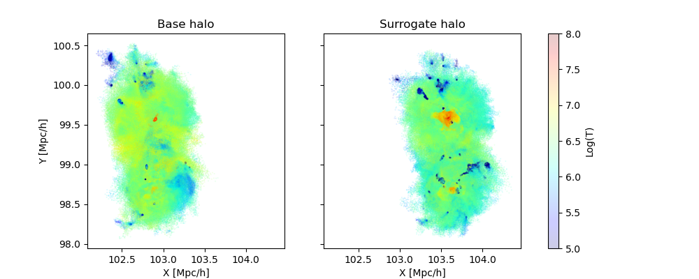

.. _zoomGZ:

CAMELS-zoomGZ
=============

CAMELS-zoomGZ is a suite of 768 zoom-in simulations of halos between the mass range of :math:`M^{13}M_\odot\,h^{-1}-M^{14.5}M_\odot\,h^{-1}`, and spanning 28 astrophysical and cosmological parameters in the IllustrisTNG galaxy formation model. The IllustrisTNG parameter space was sampled using a novel reduced variance sampling and emulation method called CARPoolGP, which differs from the standard Latin hypercube or Sobol sequence approaches. 

We refer users to the `CAMELS-zoomGZ <https://zoomgz.readthedocs.io/en/latest/>`_ website for more details on the simulations.

